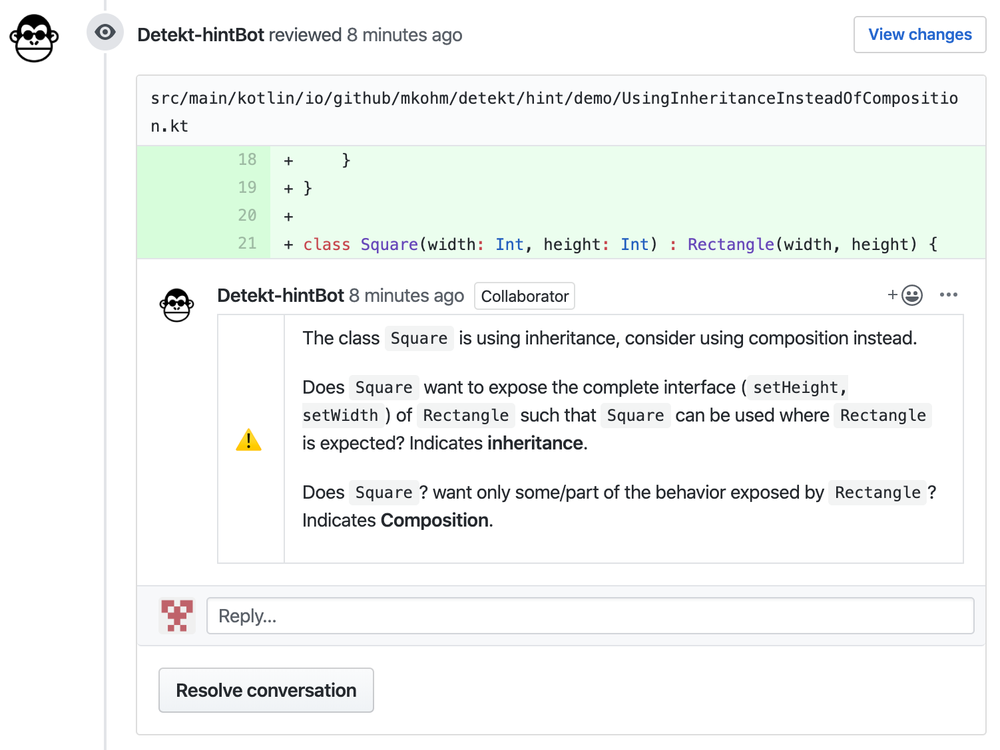
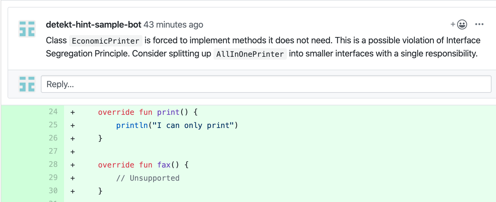
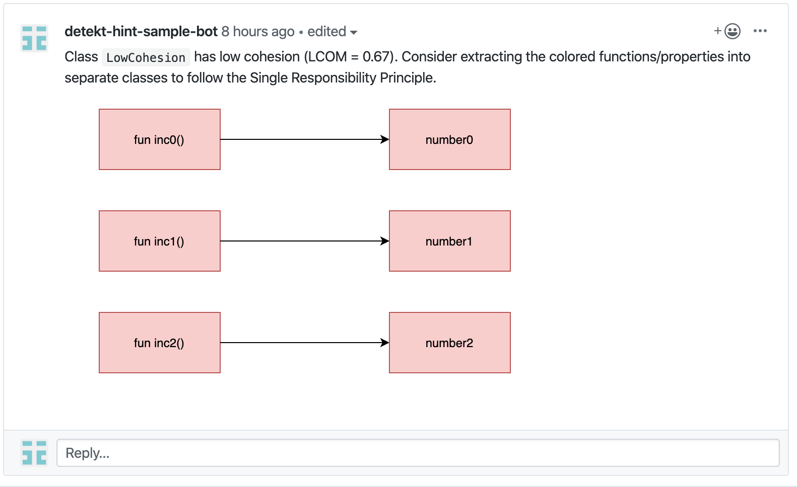
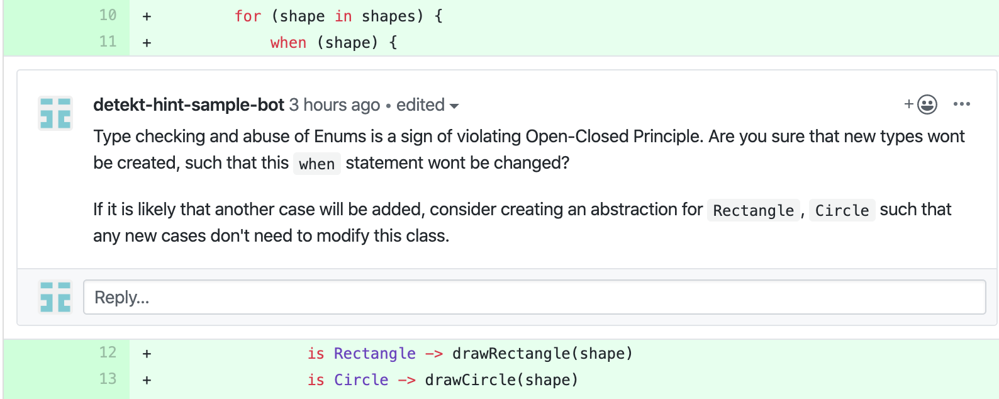

# detekt-hint
[](https://codeclimate.com/github/Mkohm/detekt-hint/maintainability) [](https://codecov.io/gh/Mkohm/detekt-hint) [](https://travis-ci.com/Mkohm/detekt-hint) [  ](https://bintray.com/bintray/jcenter/io.github.mkohm%3Adetekt-hint/_latestVersion)



detekt-hint is a plugin for [detekt](https://github.com/arturbosch/detekt) that includes detection of violation of programming principles. Since such violations are hard to detect with low false-positive rates, detekt-hint will provide hints during QA, minimizing noise during development. The idea is that a higher false-positive rate can be accepted if the detection could be of high value, and is easy to ignore. Detections on the architectural level of code is therefore most likely to provide value.

Through integration with [Danger](https://github.com/danger/danger) comments are added to the PR. Getting feedback directly on the PR makes it easy to ignore possible false-positives. Comments also include context and tips, making it easier for the developer to make the correct decisions. 

Contributions are very much welcome and if you like the project - help me out with a star :). Especially help in which rules to implement, how to implement them and how to reduce the false-positives.

## Currently supported detections
- Use composition instead of inheritance - Will help developer ensure Liskov Substitution Principle is followed. Will not report if you inherit from third-party libraries. 
- (SOON) Lack Of Cohesion of Methods - Notifies you if the LCOM value is too high.

## Upcoming features 
### Interface Segregation Principle


### Single Responsibility Principle


### Open-Closed Principle


Look in [sample-repository](https://github.com/Mkohm/detekt-hint-sample/pulls) for mockups of upcoming features.

## Getting started
If you just want to analyze some code without bothering with the Danger integration head to the [command line section](#With-the-command-line). If you want to start writing some Kotlin in a new repository with most of the setup done - head to [this sample repository](https://github.com/Mkohm/detekt-hint-sample).

Else, grab a coffee and read on.

### Using detekt-hint with Danger
To add detekt-hint and Danger to your repository you will have to follow these steps:
1. Setup detekt. Look for instructions on how to use detekt with Gradle [here](https://github.com/arturbosch/detekt#with-gradle).
2. Add the detekt-plugin. Add
```
dependencies {
    detektPlugins "io.github.mkohm:detekt-hint:[version]"
}
```
to your build.gradle. Remember to enter the [latest version](https://mvnrepository.com/artifact/io.github.mkohm/detekt-hint) of detekt-hint.

3. [Getting set up with Danger](https://danger.systems/guides/getting_started.html)
- Create a `Gemfile` with the following contents in the root of your repository

```
source "https://rubygems.org"
git_source(:github) {|repo_name| "https://github.com/#{repo_name}" }

gem 'danger'
gem 'oga'
gem "danger-kotlin_detekt", "~> 0.0.3"
```

- Create a `Dangerfile` with the following contents in the root of your repository
```
# Use the kotlin_detekt danger-plugin
#kotlin_detekt.filtering = true
kotlin_detekt.report_file = "build/reports/detekt/main.xml"
kotlin_detekt.gradle_task = "detektMain"
kotlin_detekt.detekt(inline_mode: true)
```

4. [Create a bot user in Github](https://danger.systems/guides/getting_started.html#creating-a-bot-account-for-danger-to-use)

5. [Setting up an access token](https://danger.systems/guides/getting_started.html#setting-up-an-access-token)

6. [Run Danger in your CI and add access token](https://danger.systems/guides/getting_started.html#continuous-integration)

If your CI environment does not come with bundler pre-installed you also need to install Bundler and the required gems using the two commands below.
```
  - gem install bundler
  - bundle install
  - bundle exec danger --verbose # Verbose is nice for debugging if any problems occur 
```

6. Configure detekt.yml to include detekt-hint rules. Look [here](https://github.com/Mkohm/detekt-hint/blob/master/config/detekt.yml) for a sample configuration file. Make sure you enter your unique package name in the configuration for the UseCompositionInsteadOfInheritance rule.

7. Create a PR and wait for Danger to comment.

Having trouble? Please [create an issue](https://github.com/Mkohm/detekt-hint/issues/new) and i will help you out.

This repository is using detekt-hint itself, and serves as an example setup. 
### With the command line
If you only want to do some analysis on your code without the power of Danger commenting on your PR you can use the tool from the command line. You must first clone detekt and detekt-hint repositories, and then build the required jars:
```
git clone https://github.com/Mkohm/detekt-hint && git clone https://github.com/arturbosch/detekt && cd detekt-hint && ./gradlew jar && cd ../detekt/ && ./gradlew build shadowJar && cd ..
```
Use the command line utility:
```bash
java -jar detekt/detekt-cli/build/libs/detekt-cli-[version]-all.jar --plugins detekt-hint/build/libs/detekt-hint-[version].jar --config detekt-hint/config/detekt.yml --classpath <your-classpath> --input <path-to-your-awesome-project>
```
For example:
```bash
java -jar detekt/detekt-cli/build/libs/detekt-cli-1.5.0-all.jar --plugins detekt-hint/build/libs/detekt-hint-0.0.2.jar --config detekt-hint/config/detekt.yml --classpath detekt-hint/ --input detekt-hint/
```
Remember to enter the [latest](https://mvnrepository.com/artifact/io.gitlab.arturbosch.detekt/detekt-cli) detekt-cli version, the [latest](https://mvnrepository.com/artifact/io.github.mkohm/detekt-hint) detekt-hint version and the path to your classpath and source code. Also, make sure that the detekt.yml you are using contains the unique package name in the configuration for the UseCompositionInsteadOfInheritance rule. 
