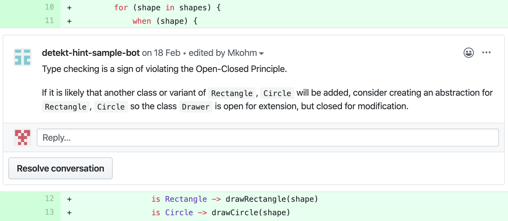

<div align="center">

# detekt-hint
Detection of design principle violations in Kotlin added as comments on pull requests.

## [Getting started](#getting-started) | :checkered_flag: [Roadmap](#upcoming-features) | :thought_balloon: [Ask a question](https://github.com/Mkohm/detekt-hint/issues/new) | :book: [Documentation](https://mkohm.github.io/detekt-hint/docs/)


[](https://gist.github.com/cheerfulstoic/d107229326a01ff0f333a1d3476e068d)
[](https://codeclimate.com/github/Mkohm/detekt-hint/maintainability) [](https://codecov.io/gh/Mkohm/detekt-hint) [](https://travis-ci.com/Mkohm/detekt-hint) [  ](https://bintray.com/bintray/jcenter/io.github.mkohm%3Adetekt-hint/_latestVersion)
[](https://github.com/KotlinBy/awesome-kotlin)


</div>

detekt-hint is a plugin for [detekt](https://github.com/arturbosch/detekt) that includes detection of violation of programming principles. Since such violations are hard to detect with low false-positive rates, detekt-hint will provide hints during QA, minimizing noise during development. The idea is that a higher false-positive rate can be accepted if the detection could be of high value, and is easy to ignore. Detections on the architectural level of code is therefore most likely to provide value.

Through integration with [Danger](https://github.com/danger/danger) comments are added to the PR. Getting feedback directly on the PR makes it easy to ignore possible false-positives. Comments also include context and tips, making it easier for the developer to make the correct decisions. 

Contributions are very much welcome and if you like the project - help me out with a :star:. Especially help in which rules to implement, how to implement them and how to reduce the false-positives.

## Currently supported detections
:white_check_mark: Use composition instead of inheritance - Will help developer ensure Liskov Substitution Principle is not violated. Will not report if you inherit from third-party libraries.

:white_check_mark: Lack Of Cohesion of Methods - Notifies you if the LCOM value is too high.

:white_check_mark: Interface Segregation Principles - Notifies you if you implement methods that the class does not need.

:white_check_mark: Open-Closed Principle - This rule reports use of switching on enums and classes, which may be a sign of violation the open closed principle.

### Interface Segregation Principle


### Single Responsibility Principle


### Open-Closed Principle


Look in [sample-repository](https://github.com/Mkohm/detekt-hint-sample/pulls) for mockups of upcoming features.

## Using detekt-hint
If you just want to analyze some code without bothering with the Danger integration head to the [command line section](#With-the-command-line). If you want to start writing some Kotlin in a new repository with most of the setup done - head to [this sample repository](https://github.com/Mkohm/detekt-hint-sample).

### With Github Actions
1. Configure a detekt-hint.yml to include detekt-hint rules and put it in a folder called "config" in your root project folder. Look [here](https://github.com/Mkohm/detekt-hint/blob/master/config/detekt-hint-config.yml) for a sample configuration file. Make sure you enter your unique package name in the configuration for the UseCompositionInsteadOfInheritance rule.

2. Create a github action using the detekt-hint docker action. See here for a [sample](https://github.com/Mkohm/detekt-hint-sample/blob/master/.github/workflows/detekt-hint.yml)

Having trouble? Please [create an issue](https://github.com/Mkohm/detekt-hint/issues/new) and i will help you out.

This repository is using detekt-hint itself, and serves as an example setup. 
### With the command line
If you only want to do some analysis on your code without the power of Danger commenting on your PR you can use the tool from the command line. You must first clone detekt and detekt-hint repositories, and then build the required jars:
```
git clone https://github.com/Mkohm/detekt-hint && git clone https://github.com/arturbosch/detekt && cd detekt-hint && ./gradlew jar && cd ../detekt/ && ./gradlew build shadowJar && cd ..
```
Use the command line utility:
```bash
java -jar detekt/detekt-cli/build/libs/detekt-cli-[version]-all.jar --plugins detekt-hint/build/libs/detekt-hint-[version].jar --config detekt-hint/config/detekt.yml --classpath <your-classpath> --input <path-to-your-awesome-project>
```
For example:
```bash
java -jar detekt/detekt-cli/build/libs/detekt-cli-1.5.0-all.jar --plugins detekt-hint/build/libs/detekt-hint-0.0.2.jar --config detekt-hint/config/detekt.yml --classpath detekt-hint/ --input detekt-hint/
```
Remember to enter the [latest](https://mvnrepository.com/artifact/io.gitlab.arturbosch.detekt/detekt-cli) detekt-cli version, the [latest](https://mvnrepository.com/artifact/io.github.mkohm/detekt-hint) detekt-hint version and the path to your classpath and source code. Also, make sure that the detekt.yml you are using contains the unique package name in the configuration for the UseCompositionInsteadOfInheritance rule. 
