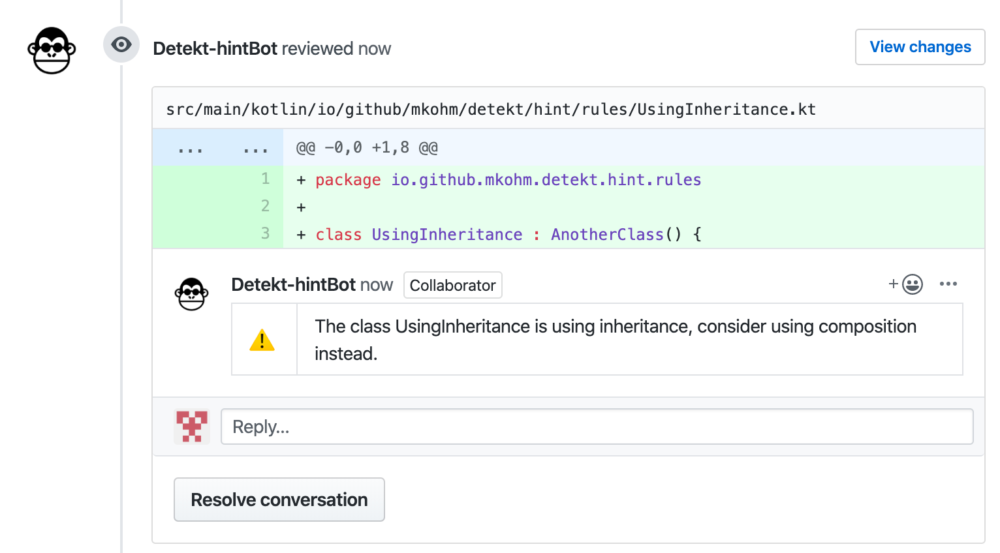

# detekt-hint
[](https://codeclimate.com/github/Mkohm/detekt-hint/maintainability) [](https://codecov.io/gh/Mkohm/detekt-hint)

detekt-hint is a plugin for [detekt](https://github.com/arturbosch/detekt) that includes detection of violation of programming principles. Since such violations are hard to detect with low false-positive rates, detekt-hint will provide hints during QA, minimizing noise during development. The idea is that a higher false-positive rate can be accepted if the detection could be of high value, and is easy to ignore. Detections on the architectural level of code is therefore most likely to provide value.

Through integration with [Danger](https://github.com/danger/danger) comments are added to the PR. Getting feedback directly on the PR makes it easy to ignore possible false-positives.

Contributions are very much welcome. Especially help in which rules to implement is of high value.


## Currently supported detections
- Use composition instead of inheritance - Will report if you inherit from a class that is in the same module.

## Getting started
This repository is using detekt-hint itself, and serves as an example setup. Another minimum example repository can be found [here](https://github.com/Mkohm/detekt-sample-setup).

### Using detekt-hint with Danger
To add detekt-hint to your repository you will have to follow these steps:
1. Setup detekt. Look for instructions on how to use detekt with Gradle [here](https://github.com/arturbosch/detekt#with-gradle).
2. Add the detekt-plugin. Add
```
dependencies {
    detektPlugins "io.github.mkohm:detekt-hint:[version]"
}
```
to your build.gradle. Remember to enter the [latest version](https://mvnrepository.com/artifact/io.github.mkohm/detekt-hint) of detekt-hint.

3. [Getting set up with Danger](https://danger.systems/guides/getting_started.html) 

4. Configure detekt.yml to include detekt-hint rules. Look [here](https://github.com/Mkohm/detekt-hint/blob/master/config/detekt.yml) for a sample configuration file.

Having trouble? Please [create an issue](https://github.com/Mkohm/detekt-hint/issues/new) and i will help you out.

## With the command line
If you only want to do some analysis on your code without the power of Danger commenting on your PR you can use the tool from the command line.
To use the extension one must first clone this repository (and the detekt repository), and then build the jar.
```
git clone https://github.com/Mkohm/detekt-hint
cd detekt-hint
./gradlew jar
```

One can then feed the jar into the detekt-cli using: 
```
java -jar <path to detekt-cli-jar> --plugins <path to detekt-hint-jar> --config <path to config file>
```
For example: `java -jar ../../../detekt/detekt-cli/build/libs/detekt-cli-1.4.0-all.jar --plugins build/libs/detekt-hint-0.0.1.jar --config detekt/detekt.yml
`
Remember to configure `detekt.yml` to include the additional rules from detekt-hint. [Here](https://github.com/Mkohm/detekt-hint/blob/master/config/detekt.yml) is an example.
